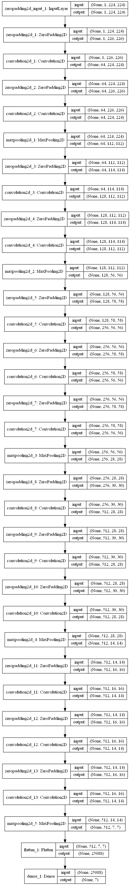

# Partial Discharge Classification using Deep Learning

> ℹ️ This document contains the full technical documentation.
> For a high-level overview, see [README.md](README.md).

> **Master’s Thesis – University of Stuttgart (2016–2017)**
> Deep Learning-based classification of Partial Discharge patterns in electrical equipment using Convolutional Neural Networks

[](https://www.python.org/)
[](https://keras.io/)
[](https://www.tensorflow.org/)
[](LICENSE)

## 📋 Table of Contents

- [Overview](#overview)
- [Problem Statement](#problem-statement)
- [Architecture & Approach](#architecture--approach)
- [Features](#features)
- [Models Implemented](#models-implemented)
- [Installation](#installation)
- [Usage](#usage)
- [Dataset Structure](#dataset-structure)
- [Results](#results)
- [Technical Details](#technical-details)
- [Project Structure](#project-structure)
- [Screenshots](#screenshots)
- [Historical Context](#historical-context)
- [Future Improvements](#future-improvements)
- [Citation](#citation)
- [License](#license)

## 🎯 Overview

This project applies **Convolutional Neural Networks (CNNs)** to automatically classify **Partial Discharge (PD)** patterns in high-voltage electrical equipment. Partial discharges are localized electrical discharges that can indicate insulation defects and potentially lead to equipment failure. Early detection and classification of PD patterns is crucial for predictive maintenance in power systems.

The system implements multiple state-of-the-art CNN architectures and includes a complete **PyQt5 GUI** for training, testing, and visualizing results, making it accessible to domain experts without deep learning expertise.

### Key Highlights

- 🔬 **Multi-Architecture Comparison**: Benchmarks 7 different CNN architectures
- 🎯 **Multi-Label Classification**: Handles simultaneous multiple fault types
- 🖼️ **Transfer Learning**: Leverages pre-trained ImageNet models
- 🖥️ **User-Friendly GUI**: Complete desktop application for non-technical users
- 📊 **Advanced Metrics**: Optimized thresholds using Matthews Correlation Coefficient
- 🔄 **Data Augmentation**: Rotation, shifting, and synthetic multi-fault generation

## ⚡ Problem Statement

**Partial Discharges (PD)** are electrical discharges that partially bridge the insulation between conductors in high-voltage equipment. They manifest as **Phase-Resolved Partial Discharge (PRPD)** patterns that can be visualized as 2D histograms:

- **X-axis**: Phase angle (0-360°) of the AC voltage cycle
- **Y-axis**: Discharge magnitude (pC - picocoulombs)
- **Color intensity**: Number of discharge events

Different types of insulation defects produce characteristic PRPD patterns:
- Internal voids
- Surface discharges
- Corona discharges
- Floating potentials
- And combinations thereof

**Challenge**: Manual interpretation requires expert knowledge and is time-consuming. This project automates classification using deep learning.

## 🏗️ Architecture & Approach

### System Architecture

```
Input PRPD Images → Data Preprocessing → CNN Model → Multi-Label Classification
                         ↓                    ↓
                   Augmentation          Threshold
                   Generation           Optimization
```

### Classification Strategy

1. **Single-Fault Learning**: Train on individual fault types
2. **Threshold Optimization**: Determine optimal probability thresholds per class using Matthews Correlation Coefficient
3. **Multi-Fault Testing**: Generate synthetic multi-fault images by overlaying single-fault patterns
4. **Evaluation**: Comprehensive metrics including Hamming loss and partial match analysis

### Data Augmentation

- Rotation (±15°)
- Width/Height shifts (10%)
- Synthetic multi-fault generation via image overlay
- Class balancing through duplication

## ✨ Features

### Training & Model Management
- **Multiple CNN architectures** to choose from
- **Hyperparameter tuning** via GUI (learning rate, momentum, decay, batch size)
- **Real-time training progress** with progress bar
- **Model persistence** (save/load architecture and weights separately)
- **Visualization** of network architecture

### Testing & Evaluation
- **Single-fault classification** with optimized thresholds
- **Multi-fault classification** (2+ simultaneous defects)
- **Random test generation** for quick validation
- **Custom image testing** from file selection
- **Folder batch testing** for entire datasets
- **Visual feedback** with color-coded results:
  - 🟢 Green: Perfect classification
  - 🟡 Yellow: Partial match (1 error)
  - 🔴 Red: No match

### Visualization
- **PRPD pattern display** with proper phase angle and discharge magnitude axes
- **Logarithmic magnitude scaling** for better visualization
- **Color mapping** for discharge event density
- **Matplotlib integration** in PyQt5 canvas

## 🤖 Models Implemented

| Model | Description | Parameters | Use Case |
|-------|-------------|------------|----------|
| **Simple CNN** | Baseline 2-layer CNN | ~500K | Quick prototyping |
| **PRPDNet** | Custom 5-layer CNN for PRPD | ~2M | Domain-specific design |
| **VGG16** | 16-layer from-scratch implementation | ~15M | Deeper feature learning |
| **Pre-trained VGG16** | Transfer learning + fine-tuning | ~15M | Limited data scenarios |
| **Pre-trained InceptionV3** | Transfer learning + fine-tuning | ~24M | Multi-scale features |
| **ResNet-101** | 101-layer residual network | ~45M | Very deep networks |
| **SegNet (Autoencoder)** | Encoder-decoder architecture | ~5M | Feature extraction |

### Architecture Example


*Example of automatically generated network architecture visualization*

## 📦 Installation

### Prerequisites

```bash
Python 3.5+
CUDA (optional, for GPU acceleration)
```

### Dependencies

```bash
pip install -r Code/requirements.txt
```

**requirements.txt**:
```
six==1.10.0
h5py==2.6.0
matplotlib==2.0.0
numpy==1.12.1
Pillow==4.1.1
PyQt5==5.8.2
keras==2.0.4
scikit_learn==0.18.1
tensorflow==1.x  # or tensorflow-gpu==1.x
```

### ⚠️ Compatibility Note

This project was developed in 2016-2017 and uses **Keras 2.0** with **TensorFlow 1.x** backend. For modern Python environments, you may need to:

1. Use a virtual environment with Python 3.6
2. Install TensorFlow 1.15 (last 1.x version)
3. Or migrate code to Keras/TensorFlow 2.x (see [Migration Guide](#migration-guide))

## 🚀 Usage

### GUI Application

```bash
cd Code
python gui_control.py
```

This launches the main application window with:

1. **Setup Panel**: Configure training parameters
   - Select image directory
   - Choose CNN architecture
   - Set hyperparameters (learning rate, batch size, epochs)
   - Configure image preprocessing (grayscale/color, size)

2. **Training Panel**: Train models
   - Start training
   - Monitor progress bar
   - View training metrics

3. **Testing Panel**: Evaluate models
   - Random test generation
   - Load and test specific images
   - Batch folder testing
   - View original vs predicted labels

4. **Management Panel**: Save/load models
   - Export trained models (JSON + weights)
   - Import pre-trained models
   - Manage configurations

### Programmatic Usage

```python
import helfer as h
import architekturen as a

# Setup configuration
data_dict = {
    'path': 'path/to/images/',
    'img_size': (224, 224),
    'gray': False,
    'klassen': ['void', 'surface', 'corona'],
    'nb_batch': 32,
    'nb_epoch': 50,
    'lrate': 0.01,
    'momentum': 0.9,
    'decay': 1e-6,
    'nestorov': True,
    'ratio': 0.2,  # test split
    'seed': 8008
}

# Prepare data
data_dict = h.prep_data(data_dict)
train_len, test_len, splits = h.transplit(data_dict)

# Create generators
train_gen, test_gen = h.make_generators(data_dict)

# Build model
creator = a.Model_Creator(data_dict, train_gen)
model = creator.create_model('VGG16')  # or 'ResNet', 'pre_VGG16', etc.

# Train
history = model.fit_generator(
    train_gen,
    validation_data=test_gen,
    epochs=50
)

# Evaluate
data_dict = h.predictions_onefold(model, test_gen, data_dict)
```

## 📁 Dataset Structure

Expected directory structure:

```
dataset/
├── fault_type_1/
│   ├── fault_type_10.png
│   ├── fault_type_11.png
│   └── ...
├── fault_type_2/
│   ├── fault_type_20.png
│   ├── fault_type_21.png
│   └── ...
└── fault_type_n/
    └── ...
```

The system automatically:
- Detects classes from folder names
- Renames files consistently
- Balances classes by duplication
- Splits into train/test sets
- Creates temporary working directories

### Image Format

- **Format**: PNG recommended
- **Content**: PRPD pattern (phase angle vs magnitude heatmap)
- **Size**: Configurable (default: 224×224 for transfer learning)
- **Color**: Grayscale or RGB

## 📊 Results

### Evaluation Metrics

1. **Single-Fault Accuracy**: % of correctly classified single-fault images
2. **Multi-Fault Metrics**:
   - **Hamming Loss**: Fraction of incorrectly predicted labels
   - **2r (2 right)**: Both faults correctly identified
   - **1r (1 right)**: Exactly one fault correctly identified
   - **1r_1f**: One correct + one false positive
   - **0r (0 right)**: Completely incorrect

### Threshold Optimization

For each class, the system searches for optimal probability thresholds (0.001 to 1.0) that maximize the Matthews Correlation Coefficient:

```
MCC = (TP×TN - FP×FN) / √((TP+FP)(TP+FN)(TN+FP)(TN+FN))
```

This accounts for class imbalance and provides better multi-label classification than fixed thresholds.

## 🔧 Technical Details

### Key Components

| File | Purpose |
|------|---------|
| `gui_control.py` | Main PyQt5 GUI application |
| `gui.py` | GUI layout and widgets (generated) |
| `TE_CNN.py` | Training pipeline orchestration |
| `architekturen.py` | CNN architecture definitions |
| `helfer.py` | Utility functions (data prep, metrics, testing) |
| `ResNet.py` | ResNet builder implementation |
| `segnet_model.py` | SegNet autoencoder implementation |

### Model Creation Pattern

```python
class Model_Creator:
    def __init__(self, data_dict, train_generator):
        self.img_size = data_dict['img_size']
        self.klassen = data_dict['klassen']
        self.num_channels = 3 if not data_dict['gray'] else 1

    def VGG16(self):
        # Returns compiled Keras model
        ...

    def ResNet(self):
        # Returns compiled Keras model
        ...
```

### Transfer Learning Approach

Pre-trained models (VGG16, InceptionV3) use a two-stage fine-tuning process:

1. **Stage 1**: Freeze convolutional base, train only new FC layers (100 epochs)
2. **Stage 2**: Unfreeze last CNN block, fine-tune with low learning rate (100 epochs)

### Multi-Fault Image Generation

```python
def multi_class_image_gen(data_dict, src_folder):
    """Generates all non-redundant combinations of fault pairs"""
    for class_A in classes:
        for class_B in remaining_classes:
            img_combined = (img_A + img_B) / 2  # Overlay
            yield img_combined, [class_A, class_B]
```

## 📸 Screenshots

### Main Application Window
*(Add screenshot of your GUI here)*

### Training in Progress
*(Add screenshot showing progress bar and metrics)*

### Classification Results
*(Add screenshot of the PRPD visualization with predictions)*

## 🕰️ Historical Context

This project was completed in **2016-2017** as a master's thesis, when:

- **Keras** was the dominant high-level deep learning framework
- **Transfer learning** for industrial applications was emerging
- **Multi-label classification** with CNNs was relatively novel
- **ResNet** and **Inception** were state-of-the-art architectures
- **Deep learning for PRPD analysis** was cutting-edge research

### What Was Advanced Then

✅ Transfer learning with fine-tuning
✅ Multi-label classification for fault diagnosis
✅ Custom metric optimization (MCC)
✅ End-to-end GUI application
✅ Synthetic multi-fault generation

### What Would Be Different Today (2024+)

- Use **TensorFlow 2.x / Keras 3.x** with modern APIs
- Leverage **EfficientNet, Vision Transformers (ViT), or ConvNeXt** architectures
- Apply **mixed precision training** for faster GPU utilization
- Use **Weights & Biases** or **TensorBoard** for experiment tracking
- Implement **explainability** (Grad-CAM, attention maps)
- Deploy with **ONNX** or **TensorFlow Lite** for edge devices
- Use **PyTorch** ecosystem (increasingly popular)

## 🔄 Migration Guide

To run this project on modern systems:

### Option 1: Legacy Environment (Recommended for Historical Accuracy)

```bash
conda create -n pd-legacy python=3.6
conda activate pd-legacy
pip install tensorflow==1.15 keras==2.2.4
pip install PyQt5==5.8.2 matplotlib==2.0.0 scikit-learn==0.18.1
```

### Option 2: Modernize to TensorFlow 2.x

Key changes needed:
- Replace `Convolution2D` → `Conv2D`
- Replace `nb_epoch` → `epochs`
- Replace `samples_per_epoch` → `steps_per_epoch`
- Replace `nb_batch` → `batch_size`
- Update `Model(input=..., output=...)` → `Model(inputs=..., outputs=...)`
- Replace `merge` → `tf.keras.layers.Add()` or `Concatenate()`
- Update `image_dim_ordering()` → `image_data_format()`

## 🚀 Future Improvements

Potential enhancements for this project:

1. **Model Improvements**
   - [ ] Implement Vision Transformers (ViT)
   - [ ] Add attention mechanisms
   - [ ] Experiment with EfficientNet family
   - [ ] Try AutoML for architecture search

2. **Explainability**
   - [ ] Add Grad-CAM visualizations
   - [ ] Implement SHAP values
   - [ ] Create attention heatmaps

3. **Engineering**
   - [ ] Migrate to TensorFlow 2.x
   - [ ] Add Docker containerization
   - [ ] Implement REST API for inference
   - [ ] Create web-based UI (Flask/FastAPI + React)

4. **Data & Training**
   - [ ] Add more augmentation techniques (CutMix, MixUp)
   - [ ] Implement contrastive learning
   - [ ] Try semi-supervised learning
   - [ ] Add uncertainty quantification

5. **Deployment**
   - [ ] Export to ONNX
   - [ ] Create mobile app (TensorFlow Lite)
   - [ ] Cloud deployment (AWS/Azure/GCP)
   - [ ] Edge device optimization

## 📚 Citation

If you use this work in your research, please cite:

```bibtex
@mastersthesis{ziegler2017pd,
  title={Implementierung eines neuronalen Netzes für die Klassifikation von Teilentladungsmustern},
  author={Ziegler, Wilhelm},
  year={2017},
  school={University of Stuttgart}
}
```

## 📄 License

This project is licensed under the MIT License - see the [LICENSE](LICENSE) file for details.

## 🤝 Contributing

While this is a completed historical thesis project, contributions for modernization are welcome:

1. Fork the repository
2. Create a feature branch (`git checkout -b feature/modernize-tf2`)
3. Commit your changes (`git commit -am 'Migrate to TensorFlow 2.x'`)
4. Push to the branch (`git push origin feature/modernize-tf2`)
5. Open a Pull Request

## 📧 Contact

**Author**: W. Ziegler
**Email**: w_ziegler@outlook.com
**LinkedIn**: https://www.linkedin.com/in/wilhelm-ziegler/
**Year**: 2016-2017

---

## 🙏 Acknowledgments

- Thesis supervisors and advisors
- Electrical engineering department for domain expertise
- Open-source community (Keras, TensorFlow, PyQt)
- Research papers that inspired architectural choices

---

<div align="center">

**⭐ If you find this project interesting, please consider giving it a star! ⭐**

*Built with ❤️ using Keras and TensorFlow*

</div>
